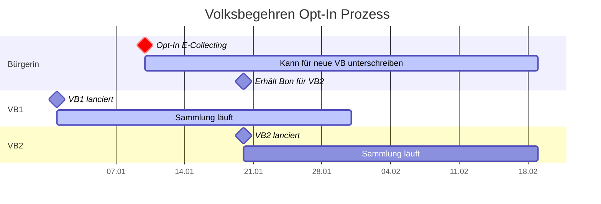

# E-Collecting Opt-In Prozess

```mermaid
gantt
    title Volksbegehren Opt-In Prozess
    dateFormat YYYY-MM-DD
    axisFormat %d.%m
    
    section Bürgerin
    Opt-In E-Collecting    :crit, milestone, opt, 2024-01-10, 0d
    Kann für neue VB unterschreiben    :active, buerger_aktiv, 2024-01-10, 40d
    Erhält Bon für VB2     :milestone, bon, 2024-01-20, 0d
    
    section VB1
    VB1 lanciert           :milestone, m1, 2024-01-01, 0d
    Sammlung läuft         :active, vb1_sammlung, 2024-01-01, 30d    
    
    section VB2
    VB2 lanciert           :milestone, m3, 2024-01-20, 0d
    Sammlung läuft         :vb2_sammlung, 2024-01-20, 30d

```
Opt-In Prozess © is licensed under [CC BY-SA 4.0](https://creativecommons.org/licenses/by-sa/4.0/)

