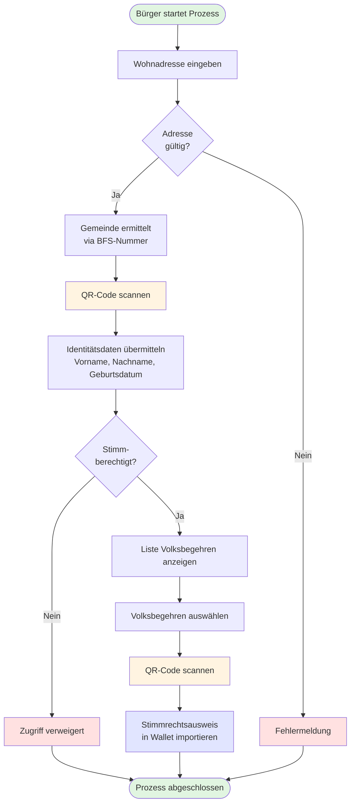

# 3) Update_CH

*[Beta E-Collecting](https://beta.ecollecting.ch) Das Pilotprojekt startete im Dezember 2024. Es will das Sammeln von Unterschriften für Volksbegehren digital, sicher und barrierefrei machen – als Ergänzung zum Papier. Dieser Pilot testet eine mögliche Variante von E-Collecting mittels der Beta-ID des Bundes. Hinter dem nicht profitorientierten Projekt stehen der Digital Democracy Hub Schweiz und die Stiftung für direkte Demokratie.*

## Kernidee und Ausgangspunkt

**Einleitung:**

Am Hackathon möchten wir das [Pilotprojekt](https://beta.ecollecting.ch/de/stimmregister) mit Fokus auf  Stimmregister-Nachweis für anonyme Willensbekundungen weiterentwickeln. 

Unser System ermöglicht das digitale Sammeln von Unterschriften für Volksbegehren unter Nutzung der swiyu E-ID und Blockchain-Technologie. Die Kernprinzipien sind:

-   **Totale Transparenz**: Alle Beteiligten können jederzeit den Sammelstatus auf der öffentlichen Blockchain prüfen
-   **Maximale Sicherheit**: Kryptografische Verankerung statt Handschrift, kombiniert mit Hardware-Security-Modulen in den Gemeinden
-   **Privacy-by-Design**: Anonyme Unterschriften via Nullifier-Konzept -- keine personenbezogenen Daten on-chain
-   **Föderale Souveränität**: Gemeinden behalten ihre autonome Rolle bei der Bescheinigung

## 1. Zielsetzung für den Hackathon
E-Collecting ermöglicht es Bürger:innen, mit Hilfe der SSI-basierten **swiyu E-ID App** ihre Stimmberechtigung nachzuweisen und Willensbekundungen **fälschungssicher, anonym und einmalig** für ein konkretes Volksbegehren abzugeben.

Unser Wirken vor Ort adressiert primär die Topics 2, 5, 6 und 7:

| Topic | Titel | Beschreibung |
| -- | --- | ------- |
| [**Topic 1**](https://github.com/swiss/e-collecting-hackathon-team3/issues/4) | Vom Unterstützungswillen zur Unterstützungsbekundung |  |
| [**Topic 2**](https://github.com/swiss/e-collecting-hackathon-team3/issues/5) | Zugang zu aktuellen Informationen über die eingereichten Unterstützungsbekundungen | Real-time Blockchain Explorer und Statistik-Dashboard für totale Transparenz |
| [**Topic 3**](https://github.com/swiss/e-collecting-hackathon-team3/issues/3) | Zuschreibung der Unterstützungsbekundungen an Komitees und Sammelunternehmen |  |
| [**Topic 4**](https://github.com/swiss/e-collecting-hackathon-team3/issues/7) | Unterbreitung von Argumenten der Komitees via E-Collecting | ❌ wird von unserem Projekt nicht direkt adressiert |
| [**Topic 5**](https://github.com/swiss/e-collecting-hackathon-team3/issues/8) | Ausschluss unrechtmässiger Unterstützungsbekundungen | Durch swiyu E-ID-Authentifizierung und unser innovatives Nullifier-Konzept für anonymen Duplikat-Schutz auf der Blockchain |
| [**Topic 6**](https://github.com/swiss/e-collecting-hackathon-team3/issues/9) | Verhinderung unterschlagener Unterstützungsbekundungen | Via Quittungs-VC und öffentlich verifizierbarer Blockchain – Bürger:innen können ihre Unterschrift jederzeit selbst prüfen (entspricht dem "Tracker-Konzept" aus dem Whitepaper) |
| [**Topic 7**](https://github.com/swiss/e-collecting-hackathon-team3/issues/10) | Wahrung des Stimmgeheimnisses | Privacy-by-Design mit Nullifier statt Identität on-chain (entspricht Stufe 2 im Whitepaper, erweiterbar auf Stufe 3 mit ZK-Proofs) |
| [**Topic 8**](https://github.com/swiss/e-collecting-hackathon-team3/issues/11) | Integration mit dem papierbasierten Prozess |  |
| [**Topic 9**](https://github.com/swiss/e-collecting-hackathon-team3/issues/12) | Erleichterte Einführung für Gemeinden mit Effizienzgewinn; auf der Grundlage von bestehender Infrastruktur und bestehenden Prozessen |  |
| [**Topic 10**](https://github.com/swiss/e-collecting-hackathon-team3/issues/13) | E-Collecting für alle föderalen Ebenen |  |

## Videos
### E-Collecting: Eröffnungsevent Partizipativer Prozess
Vorstellung Democracy Hub Schweiz und präsentation erste Version des Beta E-Collecting Pilots
[](https://youtu.be/WGUTi2jSaYw?si=ZXLnd7OrheMFf-jG&t=7224)


### Partizipations-Meeting - Réunion de participation | 02.10.2025 | beta.ecollecting.ch 
Vorstellung neue Version des Beta E-Collecting Pilot

[](https://youtu.be/Tgu5kQuClOU?si=ClhrBP_JFL2wON_5&t=3544)

## Screenshots
### Adminoberfläche Stimmrechtsausweis als VC


### Adminoberfläche Demo Gemeinde


## Diagramme

### Flussdiagramm Stimmrechtsausweis ausstellen


[Stimmrechtsausweis Flussdiagramm.md](https://github.com/Digital-Democracy-Hub-Schweiz/e-collecting-pilot/blob/main/Konzepte/Stimmrechtsausweis%20Flussdiagramm.md) © 2025 by [Digital Democracy Hub](https://digitaldemocracyhub.ch) is licensed under [CC BY-SA 4.0](https://creativecommons.org/licenses/by-sa/4.0/)
Eine Kopie ist hier im Repository abgelegt: docs/diagramms/Stimmrechtsausweis Flussdiagramm.md & docs/diagramms/Stimmrechtsausweis Squenzdiagramm.md

## Developer Setup

### Commit Konventionen

Wir verwenden [conventionalcommits](https://www.conventionalcommits.org/en/) für unsere Commit-Nachrichten.

### Prettier & Husky

Folgen Sie der Anleitung für die Installation:

```bash
# Installation
npm install --save-dev husky prettier pretty-quick
npx husky init

# Pre-commit Hook in .husky/pre_commit konfigurieren
npx pretty-quick --staged

# This tells your system: "Hey, this file is a script that can be executed."
chmod +x .husky/pre-commit

# make some changes
git add .
git commit -m "your new message"
git push
```

## Contributing

Please read [CONTRIBUTING.md](/CONTRIBUTING.md) for details on our code of conduct.

## Team Members

- [Sandro Scalco](https://github.com/sansan88) - Digital Democracy Hub Schweiz
- Daniel Graf - Stiftung für direkte Demokratie
- [David Buchmann](https://github.com/dbu/) - Liip AG
- [Maximilian Rietschel](https://github.com/romtecmax)
- [Erik Schönenberger](https://github.com/datenreisen)
- Lucian Butera

## License

This software is licensed under a EUPL 1.2 License - see the [LICENSE](LICENSE) file for details. All concepts and documents (markdown files) are licensed under CC BY-SA 4.0.
