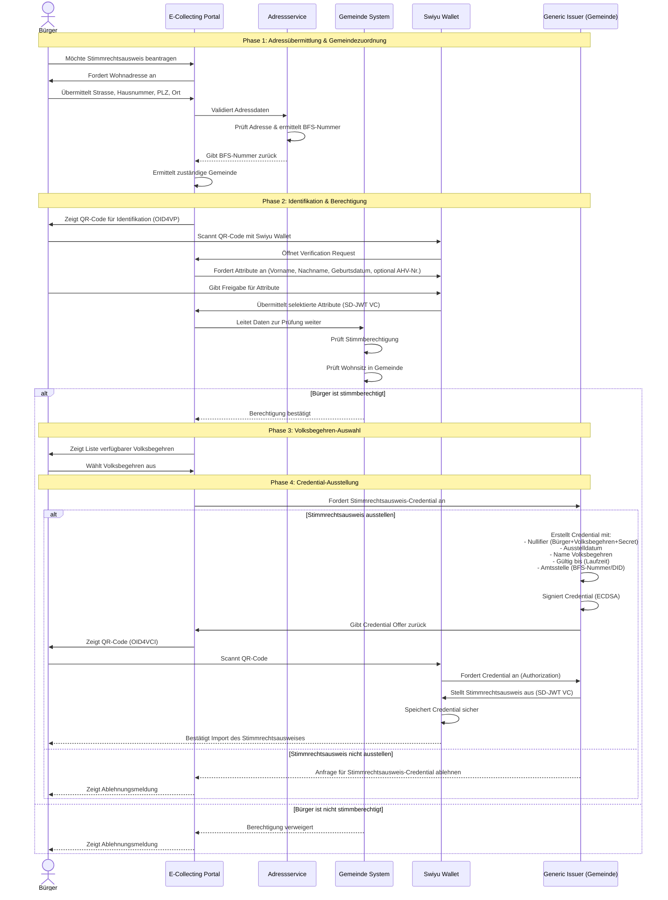

# 3) Update_CH

*[Beta E-Collecting](https://beta.ecollecting.ch) Das Pilotprojekt startete im Dezember 2024. Es will das Sammeln von Unterschriften für Volksbegehren digital, sicher und barrierefrei machen – als Ergänzung zum Papier. Dieser Pilot testet eine mögliche Variante von E-Collecting mittels der Beta-ID des Bundes. Hinter dem nicht profitorientierten Projekt stehen der Digital Democracy Hub Schweiz und die Stiftung für direkte Demokratie.*

## Approach

**Kernidee und Ausgangspunkt:**

Am Hackathon möchten wir das [Pilotprojekt](https://beta.ecollecting.ch/de/stimmregister) mit Fokus auf  Stimmregister-Nachweis für anonyme Willensbekundungen weiterentwickeln. 

Unser System ermöglicht das digitale Sammeln von Unterschriften für Volksbegehren unter Nutzung der swiyu E-ID und Blockchain-Technologie. Die Kernprinzipien sind:

-   **Totale Transparenz**: Alle Beteiligten können jederzeit den Sammelstatus auf der öffentlichen Blockchain prüfen
-   **Maximale Sicherheit**: Kryptografische Verankerung statt Handschrift, kombiniert mit Hardware-Security-Modulen in den Gemeinden
-   **Privacy-by-Design**: Anonyme Unterschriften via Nullifier-Konzept -- keine personenbezogenen Daten on-chain
-   **Föderale Souveränität**: Gemeinden behalten ihre autonome Rolle bei der Bescheinigung

## 1. Zielsetzung
E-Collecting ermöglicht es Bürger:innen, mit Hilfe der SSI-basierten **swiyu E-ID App** ihre Stimmberechtigung nachzuweisen und Willensbekundungen **fälschungssicher, anonym und einmalig** für ein konkretes Volksbegehren abzugeben.

---

[Sequenzdigramm](https://github.com/Digital-Democracy-Hub-Schweiz/e-collecting-pilot/blob/main/Konzepte/Stimmrechtsausweis%20Sequenzdiagramm.md) © 2025 by [Digital Democracy Hub](https://digitaldemocracyhub.ch) is licensed under [CC BY-SA 4.0](https://creativecommons.org/licenses/by-sa/4.0/)


## Developer Setup

### Commit Konventionen

Wir verwenden [conventionalcommits](https://www.conventionalcommits.org/en/) für unsere Commit-Nachrichten.

### Prettier & Husky

Folgen Sie der Anleitung für die Installation:

```bash
# Installation
npm install --save-dev husky prettier pretty-quick
npx husky init

# Pre-commit Hook in .husky/pre_commit konfigurieren
npx pretty-quick --staged

# This tells your system: "Hey, this file is a script that can be executed."
chmod +x .husky/pre-commit

# make some changes
git add .
git commit -m "your new message"
git push
```


## Contributing

Please read [CONTRIBUTING.md](/CONTRIBUTING.md) for details on our code of conduct.

## Team Members

- [Sandro Scalco](https://github.com/sansan88) - Digital Democracy Hub Schweiz
- Daniel Graf - Stiftung für direkte Demokratie
- [David Buchmann](https://github.com/dbu/) - Liip AG
- tba
- tba

## License

This software is licensed under a EUPL 1.2 License - see the [LICENSE](LICENSE) file for details. All concepts and documents (markdown files) are licensed under CC BY-SA 4.0.
