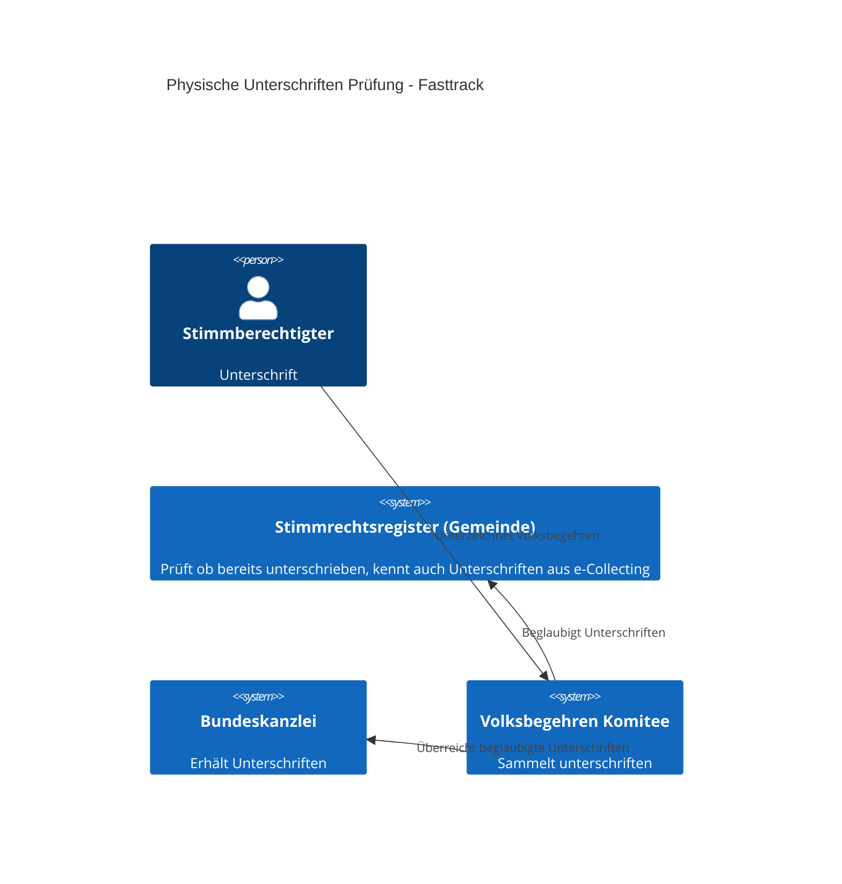

```mermaid
C4Context
title Physische Unterschriften Prüfung - Fasttrack 

Person(voter, "Stimmberechtigter", "Unterschrift")
System(register, "Stimmrechtsregister (Gemeinde)", "Prüft ob bereits unterschrieben, kennt auch Unterschriften aus e-Collecting")

System(bk, "Bundeskanzlei", "Erhält Unterschriften")

System(initiative, "Volksbegehren Komitee", "Sammelt unterschriften")

Rel(voter, initiative, "Unterzeichnet Volksbegehren")
Rel(initiative, register, "Beglaubigt Unterschriften")

Rel(initiative, bk, "Überreicht beglaubigte Unterschriften")
```