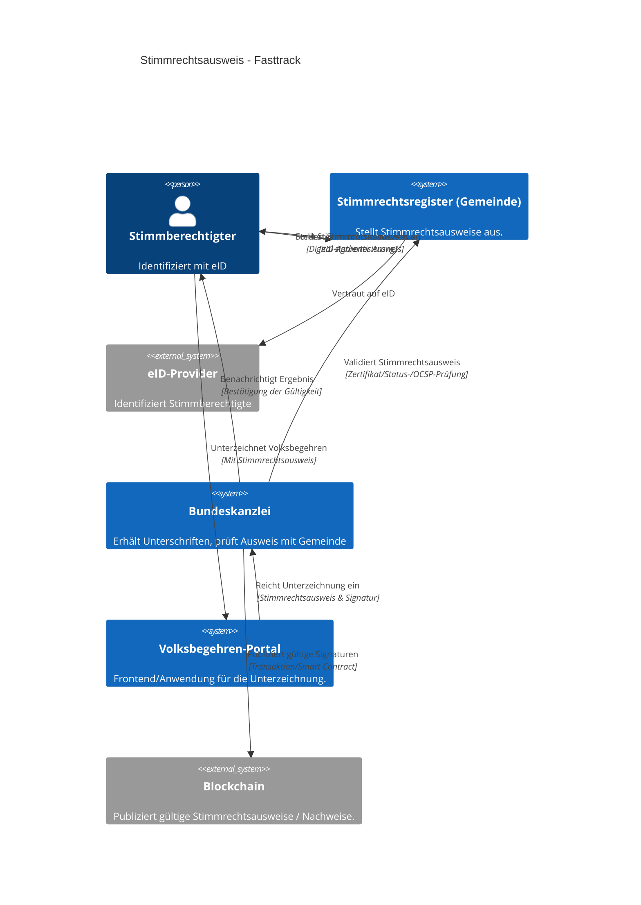

```mermaid
C4Context
title Stimmrechtsausweis - Fasttrack

Person(voter, "Stimmberechtigter", "Identifiziert mit eID")
System(register, "Stimmrechtsregister (Gemeinde)", "Stellt Stimmrechtsausweise aus.")
System_Ext(eid, "eID-Provider", "Identifiziert Stimmberechtigte")
System(bk, "Bundeskanzlei", "Erhält Unterschriften, prüft Ausweis mit Gemeinde")
System(initiative, "Volksbegehren-Portal", "Frontend/Anwendung für die Unterzeichnung.")
System_Ext(chain, "Blockchain", "Publiziert gültige Stimmrechtsausweise / Nachweise.")

Rel(voter, register, "Fordert Stimmrechtsausweis an", "eID-Authentisierung")
Rel(register, voter, "Stellt Stimmrechtsausweis aus", "Digital signierter Ausweis")

Rel(voter, initiative, "Unterzeichnet Volksbegehren", "Mit Stimmrechtsausweis")
Rel(initiative, bk, "Reicht Unterzeichnung ein", "Stimmrechtsausweis & Signatur")

Rel(bk, register, "Validiert Stimmrechtsausweis", "Zertifikat/Status-/OCSP-Prüfung")
Rel(bk, chain, "Publiziert gültige Signaturen", "Transaktion/Smart Contract")

Rel(register, eid, "Vertraut auf eID")
Rel(bk, voter, "Benachrichtigt Ergebnis", "Bestätigung der Gültigkeit")
```