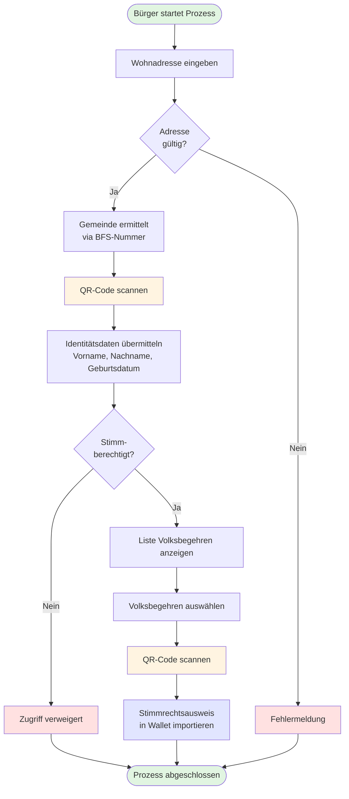

[Stimmrechtsausweis Flussdiagramm.md](https://github.com/Digital-Democracy-Hub-Schweiz/e-collecting-pilot/blob/main/Konzepte/Stimmrechtsausweis%20Flussdiagramm.md) © 2025 by [Digital Democracy Hub](https://digitaldemocracyhub.ch) is licensed under [CC BY-SA 4.0](https://creativecommons.org/licenses/by-sa/4.0/)

