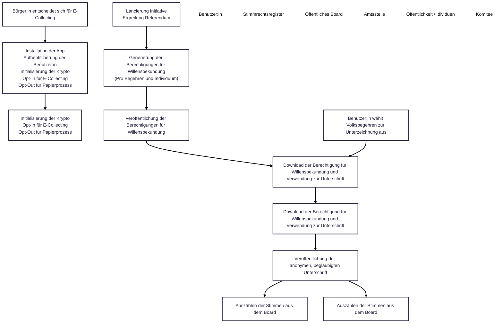

# E-Collecting Zielbild «Vertraulich, Barrierefrei, Mehrheitsfähig»

```mermaid
---
config:
  theme: redux
  layout: fixed
---
flowchart TD
    A["Bürger:in entscheidet sich für E-Collecting"] --> n1["Installation der App<br>Authentifizierung der Benutzer:in<br>Initialisierung der Krypto<br>Opt-In für E-Collecting<br>Opt-Out für Papierprozess"]
    n1 --> n2["Initialisierung der Krypto<br>Opt-In für E-Collecting<br>Opt-Out für Papierprozess"]
    D["Lancierung Initiative<br>Ergreifung Referendum"] --> n6["Generierung der Berechtigungen für Willensbekundung<br>(Pro Begehren und Individuum)"]
    n6 --> n7["Veröffentlichung der Berechtigungen für Willensbekundung"]
    n9["Download der Berechtigung für Willensbekundung und Verwendung zur Unterschrift"] --> n10["Veröffentlichung der anonymen, beglaubigten Unterschrift"]
    n7 --> n16["Download der Berechtigung für Willensbekundung und Verwendung zur Unterschrift"]
    n10 --> n12["Auszählen der Stimmen aus dem Board"] & n14["Auszählen der Stimmen aus dem Board"]
    n8["Benutzer:in wählt Volksbegehren zur Unterzeichnung aus"] --> n16
    n16 --> n9
    n3["Benutzer:in"]
    n4["Stimmrechtsregister"]
    n5["Öffentliches Board <br>"]
    n11["Amtsstelle <br>"]
    n13["Öffentlichkeit / Idividuen"]
    n15["Komitee"]
    A@{ shape: rect}
    n1@{ shape: rect}
    n2@{ shape: rect}
    n6@{ shape: rect}
    n7@{ shape: rect}
    n9@{ shape: rect}
    n10@{ shape: rect}
    n16@{ shape: rect}
    n12@{ shape: rect}
    n14@{ shape: rect}
    n8@{ shape: rect}
    n3@{ shape: text}
    n4@{ shape: text}
    n5@{ shape: text}
    n11@{ shape: text}
    n13@{ shape: text}
    n15@{ shape: text}
    style n3 color:#000000
    style n4 color:#000000
    style n5 color:#000000
    style n11 color:#000000
    style n13 color:#000000
    style n15 color:#000000
```
vision © is licensed under [CC BY-SA 4.0](https://creativecommons.org/licenses/by-sa/4.0/)
