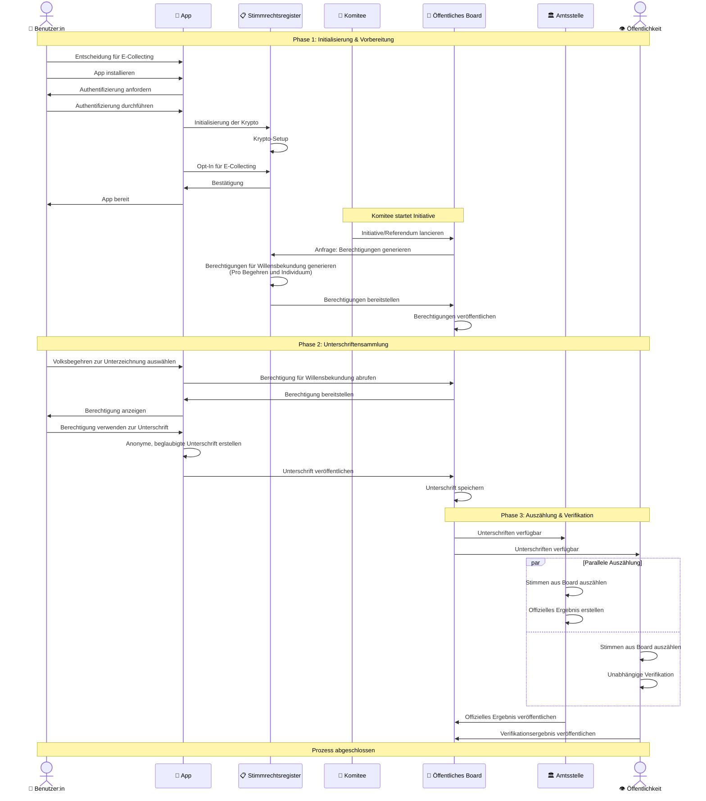

# E-Collecting Zielbild «Vertraulich, Barrierefrei, Mehrheitsfähig»

```mermaid

sequenceDiagram
    actor B as 🧑 Benutzer:in
    participant A as 📱 App
    participant R as 📋 Stimmrechtsregister
    participant K as 👥 Komitee
    participant Bo as 📢 Öffentliches Board
    participant Am as 🏛️ Amtsstelle
    actor Ö as 👁️ Öffentlichkeit
    
    Note over B,Ö: Phase 1: Initialisierung & Vorbereitung
    
    B->>A: Entscheidung für E-Collecting
    B->>A: App installieren
    A->>B: Authentifizierung anfordern
    B->>A: Authentifizierung durchführen
    A->>R: Initialisierung der Krypto
    R->>R: Krypto-Setup
    A->>R: Opt-In für E-Collecting
    R->>A: Bestätigung
    A->>B: App bereit
    
    Note over K,Bo: Komitee startet Initiative
    
    K->>Bo: Initiative/Referendum lancieren
    Bo->>R: Anfrage: Berechtigungen generieren
    R->>R: Berechtigungen für Willensbekundung generieren<br/>(Pro Begehren und Individuum)
    R->>Bo: Berechtigungen bereitstellen
    Bo->>Bo: Berechtigungen veröffentlichen
    
    Note over B,Ö: Phase 2: Unterschriftensammlung
    
    B->>A: Volksbegehren zur Unterzeichnung auswählen
    A->>Bo: Berechtigung für Willensbekundung abrufen
    Bo->>A: Berechtigung bereitstellen
    A->>B: Berechtigung anzeigen
    B->>A: Berechtigung verwenden zur Unterschrift
    A->>A: Anonyme, beglaubigte Unterschrift erstellen
    A->>Bo: Unterschrift veröffentlichen
    Bo->>Bo: Unterschrift speichern
    
    Note over Bo,Ö: Phase 3: Auszählung & Verifikation
    
    Bo->>Am: Unterschriften verfügbar
    Bo->>Ö: Unterschriften verfügbar
    
    par Parallele Auszählung
        Am->>Am: Stimmen aus Board auszählen
        Am->>Am: Offizielles Ergebnis erstellen
    and
        Ö->>Ö: Stimmen aus Board auszählen
        Ö->>Ö: Unabhängige Verifikation
    end
    
    Am->>Bo: Offizielles Ergebnis veröffentlichen
    Ö->>Bo: Verifikationsergebnis veröffentlichen
    
    Note over B,Ö: Prozess abgeschlossen

```
vision © is licensed under [CC BY-SA 4.0](https://creativecommons.org/licenses/by-sa/4.0/)
